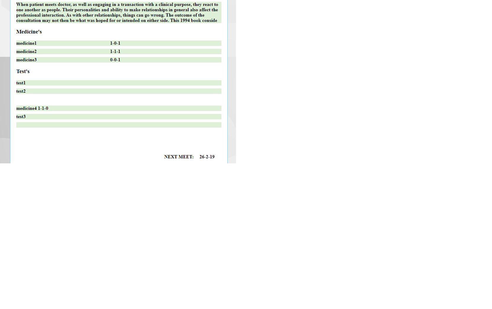

# Doctor-Appointment-System
It is web based project where user(patient) can interact with hospitals and doctors for further checkup

ADMIN
1. add doctor for any hospital.
2. make them available and unavailable for patient

Patient
1. after login they can see doctor list and hospital list
2. in Dashbord they can update profile
3. see the upcoming appointment 
4. see the history of his appointment
5. see the prescription whis was uploded by the doctor

DOCTOR
1. After signin to his profile with specific hospital id he can see the patient list
2. can upload individuals prescription to the particular patients profile which can be accesse by the patient in future

